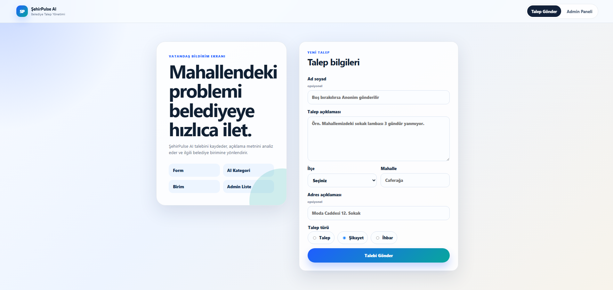
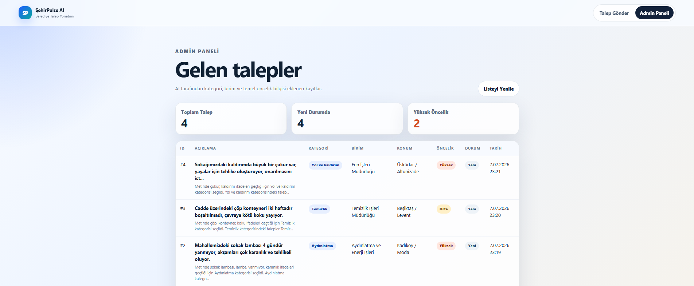

# ŞehirPulse AI

ŞehirPulse AI; vatandaşlardan gelen talep, şikâyet ve ihbarları kaydeden, açıklama metnini kural tabanlı yapay zekâ modülleriyle analiz eden ve kaydı ilgili belediye birimine yönlendiren bir talep yönetimi MVP'sidir.

## Takım 124

| Takım üyesi | Scrum rolü | Teknik sorumluluk | GitHub |
| --- | --- | --- | --- |
| Umut Can Özgül | Product Owner | Ürün kapsamı, backlog, frontend ve demo akışı | [@umutcanzgl](https://github.com/umutcanzgl) |
| Eren Altunay | Scrum Master | Takım iletişimi, backend, entegrasyon ve sprint takibi | [@EERREENN](https://github.com/EERREENN) |
| Semih Bekdaş | Developer | AI/data, test, teknik dokümantasyon ve entegrasyon desteği | [@semihbekdas](https://github.com/semihbekdas) |

## Problem ve çözüm

Belediyelere ulaşan bildirimlerin manuel okunması, sınıflandırılması ve doğru birime aktarılması zaman kaybına ve öncelikli kayıtların geç ele alınmasına neden olabilir. ŞehirPulse AI bu akışı tek bir uygulamada birleştirir:

```text
Vatandaş formu → FastAPI → AI kategori/öncelik analizi → SQLite → Admin paneli
```

### Mevcut ürün özellikleri

- Vatandaşın ad, açıklama, ilçe, mahalle, adres ve bildirim türüyle talep oluşturması
- Form ve API seviyesinde zorunlu alan/uzunluk doğrulaması
- 11 kategori için açıklanabilir, Türkçe karakterlere dayanıklı kural tabanlı sınıflandırma
- Alt kategori, güven skoru, ilgili belediye birimi ve temel öncelik önerisi
- Taleplerin SQLite veritabanına kaydedilmesi
- Admin panelinde toplam, yeni ve yüksek öncelikli talep özetleriyle kayıtların listelenmesi
- Loading, boş liste, başarı ve hata durumları
- Swagger/OpenAPI dokümantasyonu

### Henüz ürün kapsamında olmayanlar

- Kullanıcı hesabı ve rol bazlı yetkilendirme
- Admin panelinden durum/öncelik güncelleme
- Harita ve konumsal yoğunluk analizi
- Benzer talep/duplicate tespiti
- Production veritabanı ve canlı deployment

Bu ayrım, mevcut kodun yapabildikleriyle README'deki iddiaların aynı kalmasını sağlar.

## Uygulama ekran görüntüleri

### Vatandaş talep formu



### Admin talep listesi



## Teknoloji seti

| Katman | Teknoloji | Görev |
| --- | --- | --- |
| Frontend | React 19 + Vite 8 | Talep formu ve admin paneli |
| Backend | FastAPI + Pydantic | API, validasyon ve OpenAPI |
| Veri | SQLite + SQLAlchemy | Lokal MVP veri kalıcılığı |
| AI | Python | Kategori, alt kategori, routing ve öncelik kuralları |
| Dokümantasyon | Markdown | Backlog, sprint kanıtları, review ve retrospective |

## Kurulum ve çalıştırma

Gereksinimler: Python 3.10+ ve Node.js `20.19+` veya `22.12+`.

### 1. Backend

```bash
cd backend
python3 -m venv .venv
source .venv/bin/activate
pip install -r requirements.txt
uvicorn app.main:app --reload
```

Windows PowerShell için aktivasyon komutu: `.venv\Scripts\Activate.ps1`.

### 2. Frontend

Yeni bir terminalde:

```bash
cd frontend
npm ci
npm run dev
```

| Servis | Adres |
| --- | --- |
| Talep formu | <http://localhost:5173/report> |
| Admin paneli | <http://localhost:5173/admin/tickets> |
| Backend API | <http://localhost:8000> |
| Swagger | <http://localhost:8000/docs> |

Farklı bir backend adresi için `frontend/.env` dosyasında `VITE_API_URL` tanımlanabilir. CORS kaynakları backend tarafında `FRONTEND_ORIGINS`, veritabanı adresi ise `DATABASE_URL` ile değiştirilebilir.

## API özeti

| Metot | Endpoint | Açıklama |
| --- | --- | --- |
| `GET` | `/health` | Servis sağlık kontrolü |
| `POST` | `/tickets` | Talep oluşturma, AI analizi ve kayıt |
| `GET` | `/tickets` | Talepleri yeniden eskiye listeleme |
| `GET` | `/tickets/{id}` | Tek talep detayı; bulunamazsa `404` |

Ayrıntılı istek/yanıt örnekleri için [API sözleşmesine](docs/api-contract.md) bakılabilir.

## Proje yapısı

```text
.
├── ai/                         # Sınıflandırma, routing, öncelik ve veri seti
├── backend/app/                # FastAPI, model, şema, route ve servis katmanı
├── frontend/src/               # React ekranları ve API istemcisi
├── docs/                       # Ürün ve sprint dokümantasyonu
├── .github/                    # Issue ve pull request şablonları
├── README.md
└── TODO.md
```

## Product Backlog

Doğrulanan backlog kaynağı repository içindeki [Product Backlog](docs/product-backlog.md) dosyasıdır. Harici bir Miro/Asana bağlantısı paylaşılmadığı için boş veya doğrulanamayan bağlantı kullanılmamıştır.

---

# Sprint 1 — Çalışan MVP

**Tarih:** 19 Haziran–5 Temmuz 2026

**Sprint hedefi:** Vatandaş formundan başlayan ve admin listesinde biten uçtan uca temel akışı çalışır hâle getirmek.

### Tamamlananlar

- React talep formu ve admin liste ekranı
- FastAPI ticket API'si ve SQLite veri modeli
- Kural tabanlı kategori, alt kategori, routing ve temel öncelik modülleri
- 11 kategori ve 150 etiketli Türkçe örnekten oluşan veri seti
- Frontend–backend–AI entegrasyonu
- Hata/loading/boş durumları, smoke testler ve sprint dokümanları

### Sprint 1 kanıtları

- [Sprint planı](docs/sprint-1.md)
- [Backlog ve story point dağılımı](docs/product-backlog.md)
- [Daily Scrum notları](docs/daily-notes.md)
- [Sprint Review](docs/sprint-review-1.md)
- [Sprint Retrospective](docs/retrospective-1.md)
- [Test raporu](docs/test-report.md)

---

# Sprint 2 — Stabilizasyon ve kanıtlandırma

**Tarih:** 6–19 Temmuz 2026

**Sprint hedefi:** Çalışan MVP'yi yeniden doğrulamak, teknik/dokümantasyon borçlarını görünür kılmak ve final sprintini ölçülebilir bir backlog ile hazırlamak.

### Puan mantığı ve gerçekleşen işler

| İş | SP | Durum | Kanıt |
| --- | ---: | --- | --- |
| Frontend araç zinciri ve Vite yapılandırmasını güncelleme | 5 | Tamamlandı | `frontend/package.json`, `frontend/vite.config.js` |
| Gerçek uygulama ekran görüntülerini repository'ye ekleme | 5 | Tamamlandı | `docs/screenshots/` |
| README ve Sprint 2 kanıt dokümanlarını tamamlama | 8 | Tamamlandı | `README.md`, `docs/sprint-2.md` |
| AI veri seti ve uçtan uca smoke testlerini yeniden çalıştırma | 8 | Tamamlandı | `docs/test-report.md` |
| Sprint 3 backlog, risk ve sorumluluk planını hazırlama | 5 | Tamamlandı | `docs/sprint-3-plan.md` |
| **Toplam** | **31** | **31/31** | |

### Doğrulanan ürün durumu

- 150 satırlık mevcut veri setinde kategori etiketi uyumu: **133/150 (%88,7)**
- Aynı veri setinde öncelik etiketi uyumu: **74/150 (%49,3)**
- Backend smoke akışı: sağlık kontrolü, oluşturma, listeleme, detay ve `404` senaryoları başarılı
- Frontend production build başarılı
- Güncel frontend bağımlılık taraması: bilinen açık yok (`npm audit`)

Bu ölçümler bir production model metriği değil, mevcut sentetik veri seti üzerindeki regresyon kontrolüdür. Özellikle öncelik kuralları Sprint 3'te iyileştirilmelidir.

### Sprint 2 değerlendirmesi

Sprint 2'de yeni kullanıcı özelliği eklenmesinden çok mevcut MVP'nin kanıtları, bağımlılıkları ve teslim dokümantasyonu tamamlandı. Bu sayede çalışan parçalar ile henüz yapılmamış özellikler ayrıştırıldı; final sprintinde admin iş akışı, AI öncelik kalitesi, otomatik test ve deployment işleri P0 olarak belirlendi.

- [Sprint 2 ayrıntıları](docs/sprint-2.md)
- [Sprint 2 Review](docs/sprint-review-2.md)
- [Sprint 2 Retrospective](docs/retrospective-2.md)

---

# Sprint 3 — Final planı

**Tarih:** 20 Temmuz–2 Ağustos 2026

**Sprint hedefi:** Yönetilebilir, ölçülmüş, otomatik test edilen ve jüriye sunulabilir bir ürün sürümü çıkarmak.

**Planlanan kapasite:** **55 SP**

| Öncelik | İş | Sorumlu | SP | Bitiş ölçütü |
| --- | --- | --- | ---: | --- |
| P0 | Talep durumu ve önceliği için update API'si | Eren | 8 | `PATCH /tickets/{id}` testleri geçer |
| P0 | Admin detay, filtre, arama ve durum güncelleme UI'ı | Umut Can | 8 | İşlem API'ye kaydolur ve listede görünür |
| P0 | Öncelik modelini ölçme ve iyileştirme | Semih | 13 | Ayrı doğrulama setinde en az %75 uyum |
| P0 | Backend/AI otomatik testleri ve GitHub Actions | Eren + Semih | 8 | Her push/PR'da test ve frontend build çalışır |
| P0 | Docker ve canlıya alınabilir yapı | Eren + Umut Can | 8 | Temiz ortamda tek dokümanla çalıştırılır |
| P1 | Mobil görünüm, erişilebilirlik ve hata mesajı düzenlemeleri | Umut Can | 5 | Kritik ekranlar masaüstü/mobil kontrolden geçer |
| P0 | Final README, 3 dakikalık video ve teslim kontrolü | Tüm takım | 5 | 2 Ağustos 23.59 öncesi teslim paketi hazırdır |

Harita görünümü ve embedding tabanlı benzer talep tespiti, P0 işler tamamlanırsa alınacak **stretch goal** kapsamındadır. Ayrıntılı gün planı, bağımlılıklar ve riskler [Sprint 3 Planı](docs/sprint-3-plan.md) içinde yer alır.

## Demo akışı

1. Vatandaş `/report` ekranından örnek talep gönderir.
2. API talebi doğrular, AI analizini ekler ve veritabanına kaydeder.
3. Başarı mesajında talep numarası, kategori ve birim gösterilir.
4. Admin `/admin/tickets` ekranında kaydı, gerekçeyi ve önceliği görür.
5. Sprint 3 tamamlandığında admin durum/öncelik günceller; değişiklik kalıcı olarak saklanır.

## Dokümantasyon

| Konu | Dosya |
| --- | --- |
| Ürün tanımı ve kapsam | [docs/product-definition.md](docs/product-definition.md) |
| Product backlog | [docs/product-backlog.md](docs/product-backlog.md) |
| API sözleşmesi | [docs/api-contract.md](docs/api-contract.md) |
| Daily Scrum | [docs/daily-notes.md](docs/daily-notes.md) |
| Test sonuçları | [docs/test-report.md](docs/test-report.md) |
| Bootcamp uyum kontrolü | [docs/bootcamp-compliance.md](docs/bootcamp-compliance.md) |
| Sprint 2 kanıtları | [docs/sprint-2.md](docs/sprint-2.md) |
| Sprint 3 planı | [docs/sprint-3-plan.md](docs/sprint-3-plan.md) |

## Lisans

Bu repository'de henüz bir lisans dosyası bulunmamaktadır. Kullanım ve yeniden dağıtım koşulları takım tarafından final sprintinde netleştirilecektir.
